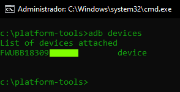
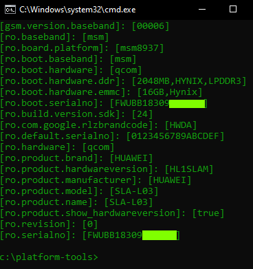

[adbrelease]: https://developer.android.com/studio/releases/platform-tools  
[appinspector]: https://play.google.com/store/apps/details?id=bg.projectoria.appinspector
# Android Debug Bridge (adb) 
### Herramienta que te permite comunicarte con tu android.  
ADB viene incluido en el paquete de herramientas de la plataforma de Android SDK. Los desarrolladores de android frecuentemente instalan este paquete con la ayuda de SDK Manager. Para casos más prácticos solo se descarga el zip desde la [**página de Android**][adbrelease] y se descomprime en algún lugar de nuestro pc.  
Nota: Para trabajar con la herramienta se puede acceder desde linea de comandos hasta la carpeta **platform-tools** y ahí ejecutar los comandos. O bien se puede optar por la opción de agregar la ruta de dicha carpeta al PATH (Windows).  

---
## Conexión con el dispositivo
1. Debemos contar con los drivers del dispositivo en la pc.  
2. En el dispositivo debemos activar la depuración USB.  
    * Configuración > A cerca de > _buscar el número de compilación_.  
    * Presionar siete veces este campo.  
    * Veremos un aviso sobre la activación del _modo desarrollador_.  
    * Vamos a Configuración > Opciones de desarrollador.  
    * Buscamos y activamos la _depuración USB_.  
3. Conectamos el dispositivo a la pc.
4. Generalmente en el dispositivo pedirá una confirmación para permitir la interacción entre la pc y el dispositivo, si no es así debemos asegurarnos que el dispositivo no esté en modo _solo carga_.  
5. Hasta este punto la pc debería haber reconocido el dispositivo, así que la conexión está establecida.  
6. Para comprobar ejecutamos el comando `adb devices` y deberíamos ver una salida como la de la imagen.  
  
Si no es así, o si en lugar de decir _device_ dice _unauthorized_ repetir desde el paso 1.
7. Si tenemos conectado más de un dispositivo, los comandos deberían lucir como `adb -s FWUBB18309****** shell pm list packages` doonde **-s** es el número de serie del dispositivo para asegurar su ejecución en el mismo.  
---  
## Comandos de utilidad  
A continuación una lista de comandos con su respectivo propósito.  
### **BORRAR APLICACIONES DE FÁBRICA**
Para esas apps que no se pueden desinstalar desde el teléfono.  
1. Identificar el nombre del paquete de la aplicación que deseamos borrar.  
    * Podemos descargar desde PlayStore alguna app como [**App Inspector**][appinspector] que al abrir nos muestra las aplicaciones y servicios del equipo, buscamos la aplicación a desinstalar y abrimos para tomar nota del _Package name_.  
    * También podemos buscar el nombre del paquete con un poco de intuición ejecutando el comando `adb shell pm list packages` donde se mostrarán todos los paquetes. Para afinar nuestra búsqueda podemos ajustar este comando según el paquete que estemos buscando:
    ~~~
    adb shell pm list packages | adb shell grep huawei  
    adb shell pm list packages | adb shell grep google  
    adb shell pm list packages | adb shell grep android
    ~~~  
    *  El nombre del paquete luce algo como: _com.google.android.music_  
2. Borrar nuestra aplicación.  
    * Ejecutamos `adb shell pm uninstall -k --user 0 <nombre del paquete>`. Ejemplo: `adb shell pm uninstall -k --user 0 com.google.android.music`. Esto desintalaría la app de _Play Music_.  
### **INSTALAR UNA APP**  
1. Ejecutamos `adb install <ruta del apk>`. Ejemplo: `adb install quickshortcutmaker.apk` teniendo este apk en la carpeta **platform-tools**.  
### **EJECUTAR UNA APP EN EL TELÉFONO**  
1. Ejecutamos `adb shell monkey -p <nombre del paquete> -c android.intent.category.LAUNCHER 1`. Ejemplo: `adb shell monkey -p quickshortcutmaker.apk -c android.intent.category.LAUNCHER 1`  
### **MOSTRAR INFORMACIÓN DEL DISPOSITIVO**  
1. Ejecutamos `adb shell getprop | adb shell grep -e 'model' -e 'version.sdk' -e 'manufacturer' -e 'hardware' -e 'platform' -e 'revision' -e 'serialno' -e 'product.name' -e 'brand' -e 'baseband'`.  
esto mostrará una salida como la de la imagen.  
  
### **MOSTRAR INFORMACIÓN DE ALMACENAMIENTO**
1. Ejecutamos `adb shell dumpsys diskstats`.  
### **MOSTRAR INFORMACIÓN DE LA BATERÍA**  
1. Ejecutamos `adb shell dumpsys battery`.  
### **MOSTRAR VERSION ARM**  
1. Ejecutamos `adb shell getprop ro.product.cpu.abi`.  
### **MOSTRAR INFORMACIÓN DEL PROCESADOR**  
1. Ejecutamos `adb shell cat /proc/cpuinfo`.  
### **BACKUP**  
1. Ejecutamos `adb pull sdcard/ respaldo/`. Nota: Previamente crear la carpeta _respaldo_, o ejecutar `adb pull sdcard/` y creará la carpeta _sdcard_ en la carpeta _platform-tools_.  
2. Para copiar solo un archivo ejecutamos `adb pull sdcard/dcim/camera/mifoto.jpg`.   
### **TOMAR CAPTURA DE PANTALLA Y TRAERLA A LA PC**  
1. Ejecutamos `adb shell screencap <ruta y nombre para guardar la captura>` Ejemplo `adb shell screencap /sdcard/pictures/screenshots/captura.png`.   
2. Ejecutamos `adb pull /sdcard/pictures/screenshots/captura.png` (siguiendo el ejemplo del punto 1).
### **PERMISSION DENIED**  
Nota: Para acceder a algunas rutas del teléfono, por ejemplo a _/data/system/_ necesitaremos permisos de root.  
Esto puede lograrse fácilmente ejecutando `adb shell` y posteriormente ejecutamos `su`, o bien apagando el daemon actual con `adb kill-server` y después acceder con `adb root`.  
Nota 2: Si existen problemas para acceder como root quizá el dispositivo necesite ser rooteado.