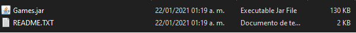
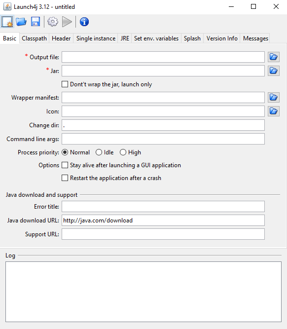
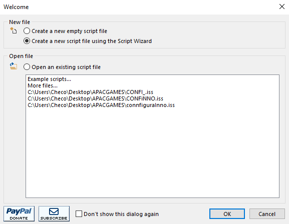

# CREACIÓN DE .EXE CON INSTALADOR DESDE .JAR CON JRE INCLUIDO
[launch]: http://launch4j.sourceforge.net/
[inno]: https://jrsoftware.org/isdl.php
[java]: https://www.java.com/es/download/

## **Antecedentes**
* Quería envíar una aplicación sencilla de escritorio a otra persona. 
* Cuando se construye una aplicación sencilla con java, al final se tendrá por ejemplo un _calculadora.jar_ o _TablaRegistrosMySQL.jar_ que para ser ejecutado requiere tener instalado JRE (Java Runtime Environment).
* La otra persona no tiene instalado JRE.

## **Generando ejecutable**
A este punto ya se debe contar con el **.jar** funcionando.  
Recomendado copiar la carpeta que contenga este archivo y mandarla al escritorio para trabajar.  
Cuando es un proyecto en Ant por ejemplo se genera una carpeta llamada _dist_ y dentro viene el archivo y las librerías que ocupamos para dicho proyecto, en la imagen de ejemplo el proyecto es simple y no tiene ningún extra.  
También es recomendado tener dos íconos preparados para agregarlos a nuestro .exe e instalador.

  

Ahora a descargar, instalar y ejecutar  [**Launch4j**][launch].

 

### **Configuración:**  
**En la pestaña _Basic_ :**

1. Output file **-->** Es el archivo .exe ejecutable que se generará. Se debe proporcionar una ruta donde se guardará y un nombre que termine con la extensión _.exe._  
Ejemplo: _C:\Users\Rai\Desktop\Games.exe_
2. Jar **-->** Es el archivo _.jar_ que se convertirá en .exe. Se proporciona la ruta del archivo.  
Ejemplo: _C:\Users\Rai\Desktop\dist\Games.exe_
3. Icon **-->** Se puede (o no) seleccionar un ícono que sea la presentación del ejecutable. Se especifica la ruta.  
Ejemplo: _C:\Users\Rai\Desktop\iconoEjecutable.ico_

**En la pestaña _JRE_ :** 

Hay dos caminos:  

* Descargar e instalar JRE en el Windows donde se ejecutará.
* Posteriormente incluir el JRE en el instalador para que vaya junto a la aplicación (pesará mucho más).

Si no se elije alguno de estos dos caminos se puede obtener un error del tipo _"this application requires a java runtime environment 1.X.X"_.

En este ejemplo me fui por la segunda opción, ya que aunque lo mejor es instalar JRE en la pc destino para que pueda interpretar este _.exe_ yo deseo obtener un instalador que genere un .exe que no dependa de tener instalado el JRE. Así que...

1. Bundled JRE path **-->** Es la ruta donde el ejecutable buscará el JRE (en cualquier pc donde se ejecute), misma que creará el instalador en la PC destino.  
Ejemplo: _C:\Program Files (x86)\Games\miJRE_

Nota 1: Si se opta por instalar directamente JRE en el Windows destino no es necesario colocar la ruta del JRE, sino únicamente llenar el campo de _Min JRE version_ específicando la versión de java que utilizamos para crear el proyecto, de esta manera el .exe sabe la versión mínima con la que se puede ejecutar correctamente.  
Nota 2: Con excepción de la selección del ícono, esta es la *configuración básica* y lo que Launch4j exige para poder generar un .exe, se pueden realizar más cambios como seleccionar una clase principal, ajustar la versión máxima soportada, entre otros. En este caso todos los demás ajustes se consideran innecesarios.
### **Generamos el ejecutable:**  
Súper fácil. Solo buscar el ícono que tiene un engranaje y que trae el tooltip _Build wrapper_.  
Al pulsarlo pedirá la ubicación para guardar un archivo de configuración .xml. Da igual donde se guarde.  
Cuando termine de construirlo se obtiene el archivo .exe, en este caso en el escritorio.  
## **Generando el instalador**
Descargar, instalar y ejecutar [**Inno Setup**][inno].
Abrirá una ventana donde se puede seleccionar la ayuda de un asistente (script wizard).  
  
Se debe ir llenando los campos _requeridos_. Aquí dejó la configuración en la versión 6.1.2:  
1. En la primer ventana se seleccionan las especificaciones de la aplicación generada por el instalador, nombre y versión.
Ejemplo: _Games_ y _1.0.0_
2. En la siguiente ventana se configura el folder base donde se instalará que por defecto es (como la mayoría de los programas) en _Program Files folder_.  
**Lo importante** es cambiar el nombre del folder generado por el de la ruta que le dimos en el Launch4j para buscar el JRE y desmarcar el checkbutton que permite al usuario modificar esta ruta.  
Ejemplo: _Games_.   (Así crea la carpeta "Games" en ProgramFiles (x86) en cualquier pc donde se instale).
3. En la siguiente ventana se especifica la ruta del .exe que generó Launch4j y que se generará cada vez que este instalador se ejecute en algún equipo.  
Y otra **configuracion importante** es seleccionar en otros archivos de aplicación la ruta del folder que contiene el jre.  
Ejemplo: _C:\Program Files\Java\jre1.8.0_271_  
Este lo incluirá en el instalador, así viajará con la aplicación.  
*Importante* editar el _destination subfolder_ para que el instalador lo genere en la carpeta que se especificó en el Launch4j, en este ejemplo _miJRE_.
4. En la siguiente ventana se desmarca la opción que habilita la vinculación con extensiones para la aplicación (a menos que la programación de la app lo requiera).
5. La siguiente ventana permite elegir si el instalador podrá generar o no accesos directos de escritorio. Marcar o desmarcar según se prefiera.
6. La siguiente ventana es para  introducir la licencia del archivo y archivos de información antes y después de la instalación. Si se poseen se proporciona la ruta. En este ejemplo se dejan vacíos.
7. En esta ventana se selecciona un modo de instalación. En este ejemplo se deja el valor por default.
8. En la siguiente ventana se seleccionan los idiomas disponibles para la instalación.
9. En esta ventana debe proporcionarse la ruta donde dejará este instalador al terminar y el nombre del instalador que se prefiera.  
Ejemplo: _C:\Users\Rai\Desktop\_ y como nombre _instaladorGames_  
También se nos permite seleccionar un ícono para el instalador.
10. Esta ventana se queda con el valor por defecto, solo damos click en _finalizar_.
11. Se ejecuta el script.

Al final se debe tener generado el nuevo instalador. Este instalador puede ejecutarse correctamente en un Windows sin tener instalado ni jre ni jdk, ya que creará el _Games.exe_ y las carpetas necesarias, copiando todo el JRE en la ruta correcta para que la aplicación pueda encontrarlo.

## **Notas finales**

* Incluir el _JRE_ completo no es lo mejor. Es mucho espacio extra que puede evitarse descargando e instalando [**Java**][java] de manera normal en la pc.

* Este ejemplo para mi personalmente es un _"no es lo lejor, pero si se puede hacer"_ que puede servir para entender una de las maneras de ejecutar un .jar en cualquier windows sin tener instalado java.

* Al final siempre se puede desinstalar la aplicación desde _Panel de control_.

